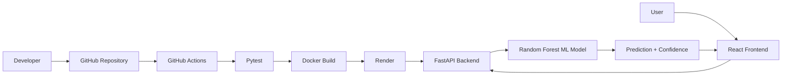

# 🤖 AI-Based Student Performance Prediction System


An end-to-end **AI and DevOps project** that predicts student academic performance using a machine learning model and automatically delivers the application through a **CI/CD pipeline** using GitHub Actions, Docker, and Render.

---

## 🌐 Live Demo

### Frontend
https://student-performance-cicd-1.onrender.com

### Backend API
https://student-performance-cicd.onrender.com

### API Documentation
https://student-performance-cicd.onrender.com/docs

### Health Check
https://student-performance-cicd.onrender.com/health

---

## 📌 Project Overview

The **AI-Based Student Performance Prediction System** is a web-based machine learning application that predicts a student's academic performance from five input features.

### User Inputs

- Attendance Percentage
- Internal Marks
- Assignment Percentage
- Study Hours per Day
- Previous Marks

### Prediction

The machine learning model predicts:

- **Good**
- **Average**
- **Poor**

The application also displays the model's prediction confidence.

---

## 🎯 Objectives

The main objectives of this project are:

1. Develop a machine learning model for student performance prediction.
2. Build a REST API using FastAPI.
3. Develop a React-based frontend.
4. Connect the frontend with the machine learning API.
5. Containerize the backend using Docker.
6. Create automated tests using Pytest.
7. Implement Continuous Integration using GitHub Actions.
8. Implement Continuous Deployment using Render.
9. Deploy the complete application publicly.

---

## 🏗️ System Architecture



---

## 🤖 Machine Learning

### Dataset

The project uses a dataset containing **500 student records** and **6 columns**.

The six columns are:

```text
attendance
internal_marks
assignment_percentage
study_hours
previous_marks
performance
```

### Input Features

The machine learning model uses five input features:

| Feature | Description |
|---|---|
| Attendance | Student attendance percentage |
| Internal Marks | Internal examination marks |
| Assignment Percentage | Assignment completion percentage |
| Study Hours | Average study hours per day |
| Previous Marks | Previous academic marks |

### Target Variable

The target variable is:

```text
performance
```

Possible target values:

```text
Good
Average
Poor
```

### Machine Learning Algorithm

The project uses:

**Random Forest Classifier**

### Training Process

```text
Student Dataset
      ↓
Data Loading
      ↓
Data Preprocessing
      ↓
Feature Selection
      ↓
Train/Test Split
      ↓
Random Forest Classifier
      ↓
Model Evaluation
      ↓
Save Trained Model
```

### Model Accuracy

The trained model achieved:

```text
Accuracy: 84.00%
```

on the test split used during development.

> Model performance can change if the dataset, preprocessing, train/test split, or model configuration is changed.

### Saved Model

The trained model is stored at:

```text
backend/model/student_model.pkl
```

---

## 🧪 Prediction Example

### Input

```json
{
  "attendance": 85,
  "internal_marks": 78,
  "assignment_percentage": 90,
  "study_hours": 4,
  "previous_marks": 82
}
```

### Output

```json
{
  "prediction": "Good",
  "confidence": 66.0
}
```

The confidence value depends on the input and trained model.

---

## ✨ Key Features

- AI-based student performance prediction
- Random Forest classification
- React frontend
- FastAPI REST API
- Prediction confidence
- Input validation
- Pytest API testing
- Docker containerization
- GitHub Actions CI
- Automated frontend build
- Automated Docker build
- Render backend deployment
- Render frontend deployment
- Public API documentation
- Health check endpoint

---

## 🔄 CI/CD Pipeline

This project uses **GitHub Actions** for Continuous Integration and **Render** for Continuous Deployment.

### CI/CD Flow

```text
Code Change
    ↓
Git Commit
    ↓
Git Push
    ↓
GitHub Repository
    ↓
GitHub Actions
    ↓
Install Python Dependencies
    ↓
Run Pytest
    ↓
Build Docker Image
    ↓
Install Frontend Dependencies
    ↓
Build React Frontend
    ↓
CI Success
    ↓
Render Auto Deployment
    ↓
Live Application
```

### Continuous Integration

GitHub Actions automatically performs:

- Checkout repository
- Setup Python
- Install backend dependencies
- Run Pytest
- Build Docker image
- Setup Node.js
- Install frontend dependencies
- Build React frontend

### Continuous Deployment

After successful changes are pushed to the `main` branch:

```text
GitHub
   ↓
GitHub Actions
   ↓
Tests + Builds
   ↓
Render
   ↓
Automatic Deployment
```

---

## ✅ CI Pipeline

The GitHub Actions workflow is located at:

```text
.github/workflows/ci-cd.yml
```

The workflow is triggered on:

```text
push → main
pull request → main
```

### Current CI Checks

```text
Backend Tests      ✅
Docker Build       ✅
Frontend Build     ✅
```

---

## 🐳 Docker

The FastAPI backend is containerized using Docker.

### Dockerfile

The project contains:

```text
Dockerfile
```

### Build Docker Image

```bash
docker build -t student-performance-api .
```

### Run Docker Container

```bash
docker run -d --name student-performance-container -p 8000:8000 student-performance-api
```

### Check Container

```bash
docker ps
```

### Local Backend URL

```text
http://127.0.0.1:8000
```

---

## 🧪 Testing

The project uses **Pytest** for backend API testing.

### Test Cases

The project tests:

- Home endpoint
- Health endpoint
- Prediction endpoint

### Run Tests

From the project root:

```bash
python -m pytest
```

Expected result:

```text
3 passed
```

Warnings may appear during testing, but the important result is that all tests pass successfully.

---

## 🔌 API Documentation

### Home Endpoint

```http
GET /
```

Example response:

```json
{
  "message": "Student Performance Prediction API is running"
}
```

---

### Health Check

```http
GET /health
```

Example response:

```json
{
  "status": "healthy",
  "model_loaded": true
}
```

---

### Prediction Endpoint

```http
POST /predict
```

Request:

```json
{
  "attendance": 85,
  "internal_marks": 78,
  "assignment_percentage": 90,
  "study_hours": 4,
  "previous_marks": 82
}
```

Response:

```json
{
  "prediction": "Good",
  "confidence": 66.0
}
```

---

## 🔐 Input Validation

The FastAPI backend validates the input values.

| Input | Valid Range |
|---|---|
| Attendance | 0–100 |
| Internal Marks | 0–100 |
| Assignment Percentage | 0–100 |
| Study Hours | 0–24 |
| Previous Marks | 0–100 |

Invalid values are rejected by the API.

---

## 🖥️ Frontend

The frontend is developed using:

- React
- JavaScript
- Vite
- CSS

### Frontend Features

- Student input form
- Input validation
- Prediction button
- Loading state
- Error handling
- Prediction result
- Confidence display
- Responsive UI

---

## 📸 Project Screenshots

### Live Student Performance Predictor


### GitHub Actions CI Pipeline


### Render Deployment


---

## 🛠️ Technology Stack

### Frontend

- React.js
- JavaScript
- Vite
- CSS

### Backend

- Python
- FastAPI
- Pydantic
- Uvicorn

### Machine Learning

- Pandas
- Scikit-learn
- Random Forest
- Joblib

### Testing

- Pytest
- FastAPI TestClient

### DevOps / CI/CD

- Git
- GitHub
- GitHub Actions
- Docker
- Docker Compose
- Render

---

## 📂 Project Structure

```text
student-performance-cicd/
│
├── frontend/
│   ├── src/
│   │   ├── main.jsx
│   │   └── style.css
│   ├── index.html
│   ├── package.json
│   └── package-lock.json
│
├── backend/
│   ├── __init__.py
│   ├── app.py
│   ├── model/
│   │   └── student_model.pkl
│   ├── tests/
│   │   ├── __init__.py
│   │   └── test_api.py
│   └── requirements.txt
│
├── dataset/
│   └── student_performance.csv
│
├── ml/
│   ├── train.py
│   └── preprocessing.py
│
├── screenshots/
│   ├── frontend.png
│   ├── github-actions.png
│   └── render-deployment.png
│
├── .github/
│   └── workflows/
│       └── ci-cd.yml
│
├── Dockerfile
├── docker-compose.yml
├── pytest.ini
├── .gitignore
└── README.md
```

---

## ⚙️ Local Setup

### 1. Clone the Repository

```bash
git clone https://github.com/muralidharanv170807-spec/student-performance-cicd.git
```

```bash
cd student-performance-cicd
```

---

### 2. Create Python Virtual Environment

```powershell
python -m venv venv
```

Activate:

```powershell
.\venv\Scripts\Activate.ps1
```

---

### 3. Install Backend Dependencies

```powershell
pip install -r backend\requirements.txt
```

---

### 4. Start FastAPI Backend

```powershell
uvicorn backend.app:app --reload
```

Backend:

```text
http://127.0.0.1:8000
```

Swagger:

```text
http://127.0.0.1:8000/docs
```

Health:

```text
http://127.0.0.1:8000/health
```

---

### 5. Start React Frontend

Open another terminal:

```powershell
cd frontend
```

Install dependencies:

```powershell
npm install
```

Start:

```powershell
npm run dev
```

Frontend:

```text
http://localhost:5173
```

---

## 🧠 Train the Model

The training script is:

```text
ml/train.py
```

Run:

```powershell
python ml\train.py
```

The trained model will be saved to:

```text
backend/model/student_model.pkl
```

---

## 🌍 Deployment

### Backend Deployment

The FastAPI backend is deployed on Render:

```text
https://student-performance-cicd.onrender.com
```

### Frontend Deployment

The React frontend is deployed on Render:

```text
https://student-performance-cicd-1.onrender.com
```

### API Documentation

```text
https://student-performance-cicd.onrender.com/docs
```

### Health Check

```text
https://student-performance-cicd.onrender.com/health
```

---

## 🔁 Development Workflow

Whenever the project is updated:

```bash
git add .
```

```bash
git commit -m "Update project"
```

```bash
git push origin main
```

Then:

```text
GitHub
   ↓
GitHub Actions
   ↓
Run Tests
   ↓
Build Docker
   ↓
Build Frontend
   ↓
Render Auto Deploy
   ↓
Updated Live Application
```

---

## 📚 Learning Outcomes

This project demonstrates practical experience with:

- Machine Learning classification
- Dataset handling
- Data preprocessing
- Model training
- Model evaluation
- Random Forest
- REST API development
- FastAPI
- React frontend development
- API integration
- Input validation
- Automated testing
- Pytest
- Docker
- Git
- GitHub
- GitHub Actions
- Continuous Integration
- Continuous Deployment
- Cloud deployment
- Render

---

## 🔮 Future Enhancements

Possible future improvements include:

- Student login and authentication
- Prediction history
- Database integration
- Student analytics dashboard
- Performance trend charts
- Feature importance visualization
- Multiple model comparison
- Automatic model retraining
- Model monitoring
- Faculty dashboard
- Student-specific reports

---

## 👨‍💻 Author

**Muralidharan V**

B.Tech Artificial Intelligence & Data Science

### GitHub

https://github.com/muralidharanv170807-spec

---

## ⭐ Project Summary

This project combines:

```text
Artificial Intelligence
        +
Machine Learning
        +
React
        +
FastAPI
        +
Docker
        +
GitHub Actions
        +
Continuous Integration
        +
Continuous Deployment
        +
Cloud Deployment
```

The complete workflow starts from **machine learning model development**, continues through **API and frontend development**, and ends with **automated testing, Docker containerization, CI/CD, and cloud deployment**.

---

## 📌 Repository

https://github.com/muralidharanv170807-spec/student-performance-cicd
