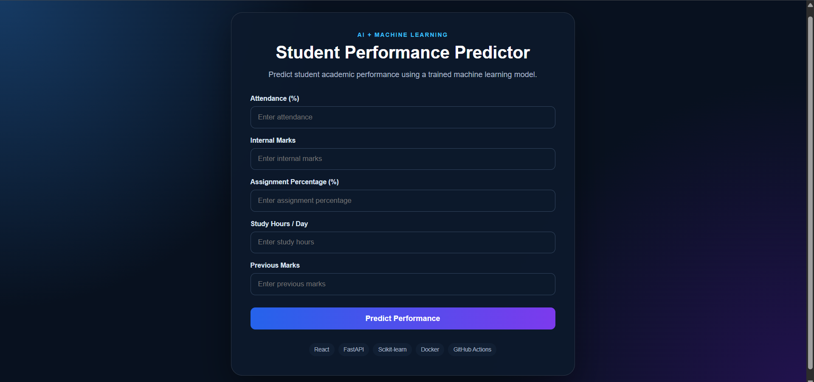
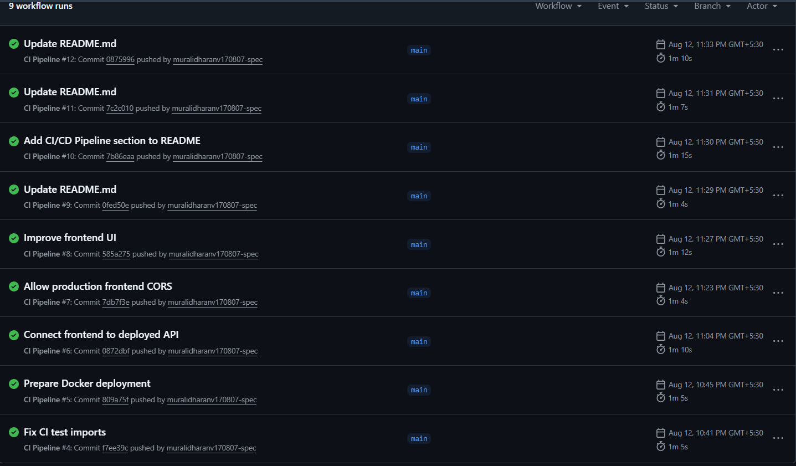
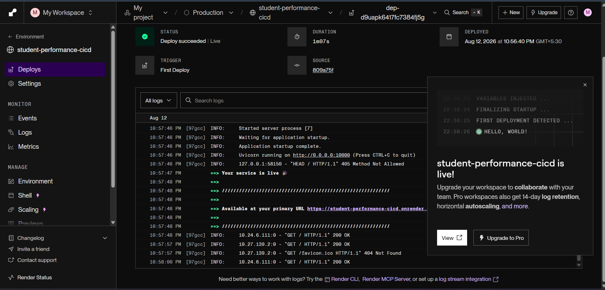

# AI-Based Student Performance Prediction System


An end-to-end **AI and DevOps project** that predicts student academic performance using machine learning and delivers the application through an automated **CI/CD pipeline** using GitHub Actions, Docker, and Render.

---

## 🚀 Live Demo

### Frontend

https://student-performance-cicd-1.onrender.com

### Backend API

https://student-performance-cicd.onrender.com

### API Documentation

https://student-performance-cicd.onrender.com/docs

### Health Check

https://student-performance-cicd.onrender.com/health

---

## 📌 Project Overview

The **AI-Based Student Performance Prediction System** predicts a student's academic performance based on five input parameters:

* Attendance
* Internal Marks
* Assignment Percentage
* Study Hours per Day
* Previous Marks

The trained machine learning model predicts the student's performance as:

* **Good**
* **Average**
* **Poor**

The application provides a web-based interface where users enter the five input values and receive the prediction and model confidence.

---

## 🎯 Objectives

The main objectives of this project are:

1. Build a machine learning model for student performance prediction.
2. Develop a REST API using FastAPI.
3. Create a React-based web interface.
4. Containerize the backend using Docker.
5. Automate testing and building with GitHub Actions.
6. Deploy the backend and frontend using Render.
7. Implement an end-to-end CI/CD workflow.

---

## 🏗️ System Architecture

```text
                    ┌──────────────────────┐
                    │        User          │
                    └──────────┬───────────┘
                               │
                               ▼
                    ┌──────────────────────┐
                    │   React Frontend     │
                    │      Vite            │
                    └──────────┬───────────┘
                               │
                               │ HTTP POST /predict
                               ▼
                    ┌──────────────────────┐
                    │   FastAPI Backend    │
                    └──────────┬───────────┘
                               │
                               ▼
                    ┌──────────────────────┐
                    │ Random Forest Model  │
                    │   Scikit-learn       │
                    └──────────┬───────────┘
                               │
                               ▼
                    ┌──────────────────────┐
                    │ Prediction Result    │
                    │ Performance +        │
                    │ Confidence            │
                    └──────────┬───────────┘
                               │
                               ▼
                    ┌──────────────────────┐
                    │   React Dashboard    │
                    └──────────────────────┘
```

---

## 🤖 Machine Learning

### Input Features

The model uses these five features:

```text
attendance
internal_marks
assignment_percentage
study_hours
previous_marks
```

### Target

```text
performance
```

The target contains:

```text
Good
Average
Poor
```

### Model

The project uses:

**Random Forest Classifier**

The dataset contains **500 student records** and **6 columns**:

```text
5 input features + 1 target column
```

### Model Accuracy

The trained model achieved:

```text
Accuracy: 84.00%
```

on the test split used during development.

> Note: Model performance may vary if the dataset, preprocessing, split, or model configuration is changed.

---

## 📊 Example Prediction

### Input

```json
{
  "attendance": 85,
  "internal_marks": 78,
  "assignment_percentage": 90,
  "study_hours": 4,
  "previous_marks": 82
}
```

### Output

```json
{
  "prediction": "Good",
  "confidence": 66.0
}
```

The confidence value can vary depending on the input.

---

## 🧪 Testing

The project uses **Pytest** for backend API testing.

Current tests include:

* Home endpoint
* Health endpoint
* Prediction endpoint

Run tests locally:

```bash
python -m pytest
```

Expected result:

```text
3 passed
```

---

## 🔄 CI/CD Pipeline

Every push to the `main` branch triggers the GitHub Actions workflow.

### Pipeline Flow

```text
Developer
    │
    ▼
Git Push
    │
    ▼
GitHub Repository
    │
    ▼
GitHub Actions
    │
    ├── Checkout Repository
    │
    ├── Setup Python
    │
    ├── Install Backend Dependencies
    │
    ├── Run Pytest
    │
    ├── Build Docker Image
    │
    ├── Setup Node.js
    │
    ├── Install Frontend Dependencies
    │
    └── Build React Frontend
    │
    ▼
Render Deployment
    │
    ├── Backend Deployment
    │
    └── Frontend Deployment
    │
    ▼
Live Application
```

### CI

**Continuous Integration** automatically:

* Installs dependencies
* Runs backend tests
* Builds the Docker image
* Builds the React frontend

### CD

**Continuous Deployment** automatically deploys new changes to Render after changes are pushed to the `main` branch.

---

## 🐳 Docker

The FastAPI backend is containerized using Docker.

### Build the Docker image

```bash
docker build -t student-performance-api .
```

### Run the container

```bash
docker run -d --name student-performance-container -p 8000:8000 student-performance-api
```

### Check running containers

```bash
docker ps
```

The API will be available at:

```text
http://127.0.0.1:8000
```

---

## 🛠️ Technology Stack

### Frontend

* React.js
* JavaScript
* Vite
* CSS

### Backend

* Python
* FastAPI
* Pydantic
* Uvicorn

### Machine Learning

* Pandas
* Scikit-learn
* Random Forest
* Joblib

### DevOps / CI/CD

* Git
* GitHub
* GitHub Actions
* Docker
* Docker Compose
* Render

### Testing

* Pytest
* FastAPI TestClient

---

## 📁 Project Structure

```text
student-performance-cicd/
│
├── frontend/
│   ├── src/
│   │   ├── main.jsx
│   │   └── style.css
│   ├── index.html
│   └── package.json
│
├── backend/
│   ├── __init__.py
│   ├── app.py
│   ├── model/
│   │   └── student_model.pkl
│   ├── tests/
│   │   ├── __init__.py
│   │   └── test_api.py
│   └── requirements.txt
│
├── dataset/
│   └── student_performance.csv
│
├── ml/
│   ├── train.py
│   └── preprocessing.py
│
├── .github/
│   └── workflows/
│       └── ci-cd.yml
│
├── Dockerfile
├── docker-compose.yml
├── pytest.ini
├── .gitignore
└── README.md
```

---

## ⚙️ Local Setup

### 1. Clone the repository

```bash
git clone https://github.com/muralidharanv170807-spec/student-performance-cicd.git
```

```bash
cd student-performance-cicd
```

---

### 2. Create a Python virtual environment

Windows PowerShell:

```powershell
python -m venv venv
```

Activate it:

```powershell
.\venv\Scripts\Activate.ps1
```

---

### 3. Install backend dependencies

```powershell
pip install -r backend\requirements.txt
```

---

### 4. Start the backend

```powershell
uvicorn backend.app:app --reload
```

Backend:

```text
http://127.0.0.1:8000
```

Swagger documentation:

```text
http://127.0.0.1:8000/docs
```

Health check:

```text
http://127.0.0.1:8000/health
```

---

### 5. Start the frontend

Open another terminal:

```powershell
cd frontend
```

Install packages:

```powershell
npm install
```

Run the frontend:

```powershell
npm run dev
```

Frontend:

```text
http://localhost:5173
```

---

## 🧠 Train the Machine Learning Model

The model-training script is located at:

```text
ml/train.py
```

Run:

```powershell
python ml\train.py
```

The trained model is saved as:

```text
backend/model/student_model.pkl
```

---

## 🔌 API Endpoints

### Home

```http
GET /
```

Example response:

```json
{
  "message": "Student Performance Prediction API is running"
}
```

### Health Check

```http
GET /health
```

Example response:

```json
{
  "status": "healthy",
  "model_loaded": true
}
```

### Prediction

```http
POST /predict
```

Request:

```json
{
  "attendance": 85,
  "internal_marks": 78,
  "assignment_percentage": 90,
  "study_hours": 4,
  "previous_marks": 82
}
```

Response:

```json
{
  "prediction": "Good",
  "confidence": 66.0
}
```

---

## 🔐 Input Validation

The API validates input ranges.

### Attendance

```text
0 - 100
```

### Internal Marks

```text
0 - 100
```

### Assignment Percentage

```text
0 - 100
```

### Study Hours

```text
0 - 24
```

### Previous Marks

```text
0 - 100
```

Invalid values are rejected by FastAPI/Pydantic.

---

## 🚀 Deployment

### Backend

The backend is deployed as a Docker Web Service on Render.

```text
https://student-performance-cicd.onrender.com
```

### Frontend

The React frontend is deployed as a Render Static Site.

```text
https://student-performance-cicd-1.onrender.com
```

---

## 🔁 Deployment Workflow

After making a code change:

```bash
git add .
git commit -m "Update project"
git push
```

Then:

```text
GitHub
   ↓
GitHub Actions
   ↓
Tests
   ↓
Docker Build
   ↓
Frontend Build
   ↓
Render Auto Deploy
   ↓
Updated Live Application
```

---

## 📸 Application Features

The application provides:

* Student performance input form
* Attendance input
* Internal marks input
* Assignment percentage input
* Study hours input
* Previous marks input
* Machine learning prediction
* Prediction confidence
* REST API
* Swagger API documentation
* Dockerized backend
* Automated testing
* Automated CI/CD
* Cloud deployment

---

## 🌐 Deployment URLs

| Component         | URL                                                                  |
| ----------------- | -------------------------------------------------------------------- |
| React Frontend    | https://student-performance-cicd-1.onrender.com                      |
| FastAPI Backend   | https://student-performance-cicd.onrender.com                        |
| Swagger Docs      | https://student-performance-cicd.onrender.com/docs                   |
| Health Check      | https://student-performance-cicd.onrender.com/health                 |
| GitHub Repository | https://github.com/muralidharanv170807-spec/student-performance-cicd |

---

## 📚 Learning Outcomes

Through this project, the following skills are demonstrated:

* Machine Learning classification
* Data preprocessing
* Model training and evaluation
* REST API development
* React frontend development
* API integration
* Unit testing
* Docker containerization
* Git and GitHub
* GitHub Actions
* Continuous Integration
* Continuous Deployment
* Cloud deployment
* End-to-end DevOps workflow

---

## 🔮 Future Enhancements

Possible future improvements include:

* Student login and authentication
* Prediction history
* Database integration
* Interactive analytics dashboard
* Multiple ML model comparison
* Automatic model retraining
* Model monitoring
* Feature importance visualization
* Performance trend graphs
* Role-based access for students and faculty

---

## 👨‍💻 Author

**Muralidharan V**

B.Tech Artificial Intelligence & Data Science

GitHub:

https://github.com/muralidharanv170807-spec

---

## ⭐ Project Summary

**AI-Based Student Performance Prediction System with Automated CI/CD** combines:

```text
Artificial Intelligence
        +
Machine Learning
        +
React
        +
FastAPI
        +
Docker
        +
GitHub Actions
        +
Cloud Deployment
```

The project demonstrates a complete software lifecycle from **machine learning model development to automated testing, containerization, CI/CD, and cloud deployment**.


## 📸 Project Screenshots

### Live Student Performance Predictor



### GitHub Actions CI Pipeline



### Render Deployment


